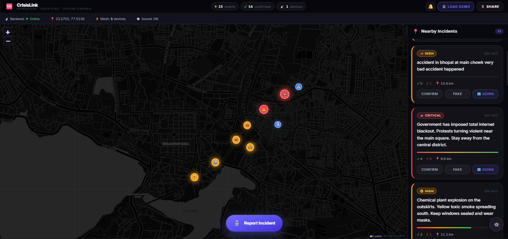

<div align="center">
  
  <br/><br/>
  <h1>🚨 CrisisLink</h1>
  <p><b>Hyperlocal, Voice-First AI Emergency Network</b></p>
  <p><i>Hackathon Submission 2026</i></p>
</div>

---

## 🎯 The Problem
In the crucial first minutes of a disaster, traditional emergency hotlines (like 911 or 100) get jammed. Victims are often in panic, typing is too slow, and language barriers prevent critical information from reaching responders. By the time official rescue teams arrive, it's often too late.

## 🚀 The Solution: CrisisLink
CrisisLink is a **mesh-aware, voice-first crisis operations center** designed to empower communities to save themselves. It replaces the traditional phone call with an intelligent **AI Dispatcher (Powered by Gemini 2.5 Flash)** that instantly processes panicked voice notes in any language, extracts the urgency, maps the coordinates, and broadcasts it to everyone within a 25km radius in real-time.

---

## ✨ Superhuman Features

- 🎤 **Walkie-Talkie Voice Reporting:** Users just hold the microphone button and speak in their native language (Hindi, English, Tamil, etc.). No typing required.
- 🧠 **Gemini 2.5 Flash Dispatcher:** The system intercepts the raw transcription, understands the *context* of the emergency (not just keywords), and automatically categorizes it by Type and Urgency (Critical, High, Medium, Low).
- 🛡️ **Ruthless Spam Filter:** Gemini acts as a bouncer, actively identifying and silently dropping jokes, test messages, and vague reports to ensure the map is only populated with real crises.
- 🗺️ **Live Operations Map:** A beautiful, dark-mode, glass-morphism map built with Leaflet that plots incidents in real-time using Socket.IO.
- 🏃‍♂️ **Instant Community Response ("Going" Routing):** A built-in "Going" button on every incident immediately opens Google Maps routing so nearby citizens can rush to the exact coordinates to help before officials arrive.
- 🔊 **Original Audio Playback:** Every incident stores the original base64 audio recording so responders can hear the raw emotion and background noise to assess the situation better.

---

## 🛠️ The Tech Stack

### Frontend (The Glass-morphism Dashboard)
* **Framework:** React 19 + Vite
* **Routing:** TanStack Router
* **Styling:** Tailwind CSS v4 + Radix UI Primitives
* **Mapping:** React-Leaflet
* **Audio:** Native `MediaRecorder` & `SpeechRecognition` API

### Backend (The Real-time Engine)
* **Server:** Node.js + Express
* **Real-time:** Socket.IO for instant map updates across all connected devices
* **AI Integration:** `@google/generative-ai` (Gemini 2.5 Flash)
* **Architecture:** Monorepo design, RESTful APIs + WebSockets

### Infrastructure & Deployment
* **Cloud Hosting:** Railway (Containerized instances for both Frontend & Backend)
* **CI/CD:** Automatic GitHub deployments

---

## 🔄 The Incident Flow

1. **The Victim:** Holds the mic button on their phone and says: *"There's a massive car crash on the main road, people are bleeding!"*
2. **The AI:** Gemini 2.5 Flash reads the text, tags it as `CRITICAL` / `ACCIDENT`, and blocks it if it detects a prank.
3. **The Network:** The Node.js server broadcasts the event via WebSockets to all devices within the radius.
4. **The Community:** Users see the red pin drop instantly. They can click **"Confirm"** to validate it, or click **"🗺️ Going"** to get immediate Google Maps directions to the scene.

---

## 🚀 Quick Start (Run Locally)

1. **Clone the repository:**
   ```bash
   git clone https://github.com/your-username/crisislink.git
   cd crisislink
   ```

2. **Start the Backend:**
   ```bash
   cd backend
   npm install
   # Create a .env file and add GEMINI_API_KEY=your_key_here
   npm start
   ```

3. **Start the Frontend:**
   ```bash
   cd ../frontend
   npm install
   # The frontend will automatically connect to localhost:3001
   npm run dev
   ```

---

<div align="center">
  <b>Built with ❤️ for emergency response, community resilience, and the future of public safety.</b><br/>
  <i>Authors: Krish Mithaulia & Team EpochZero</i>
</div>
